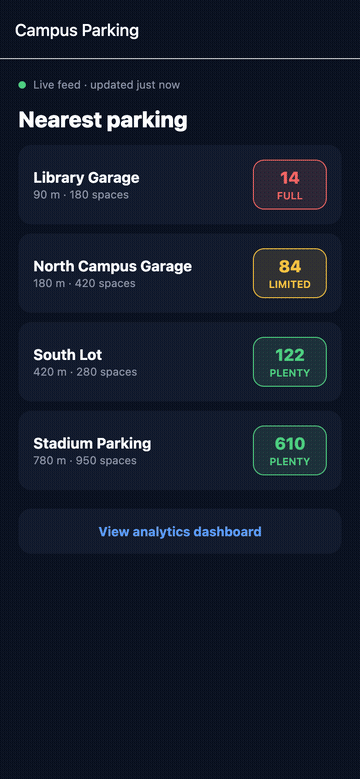
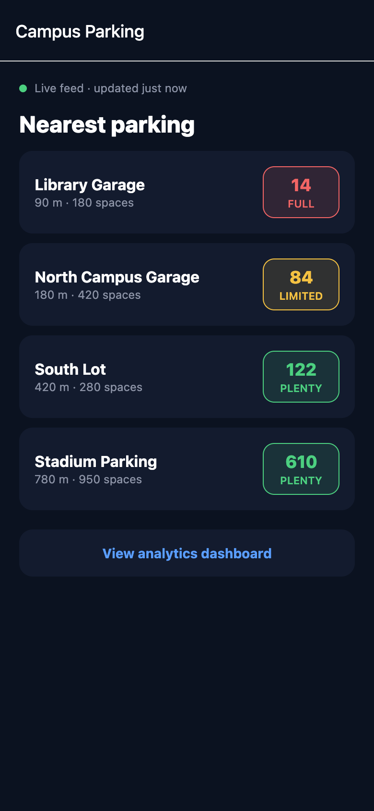
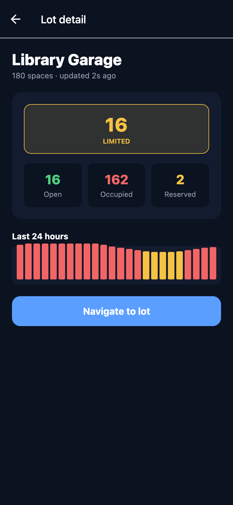
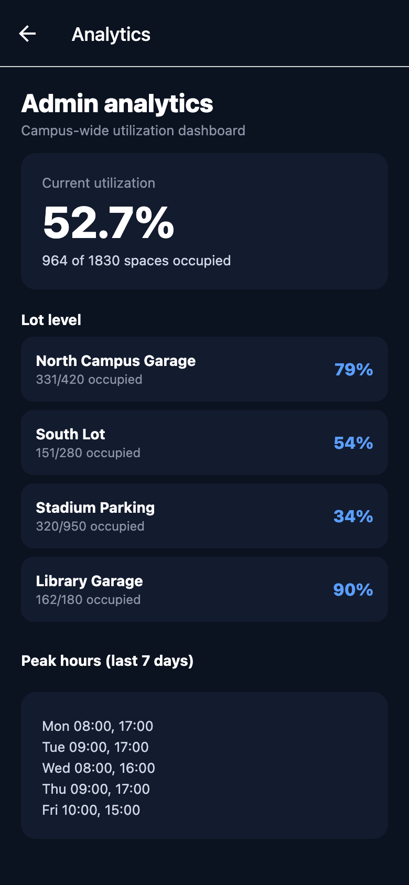
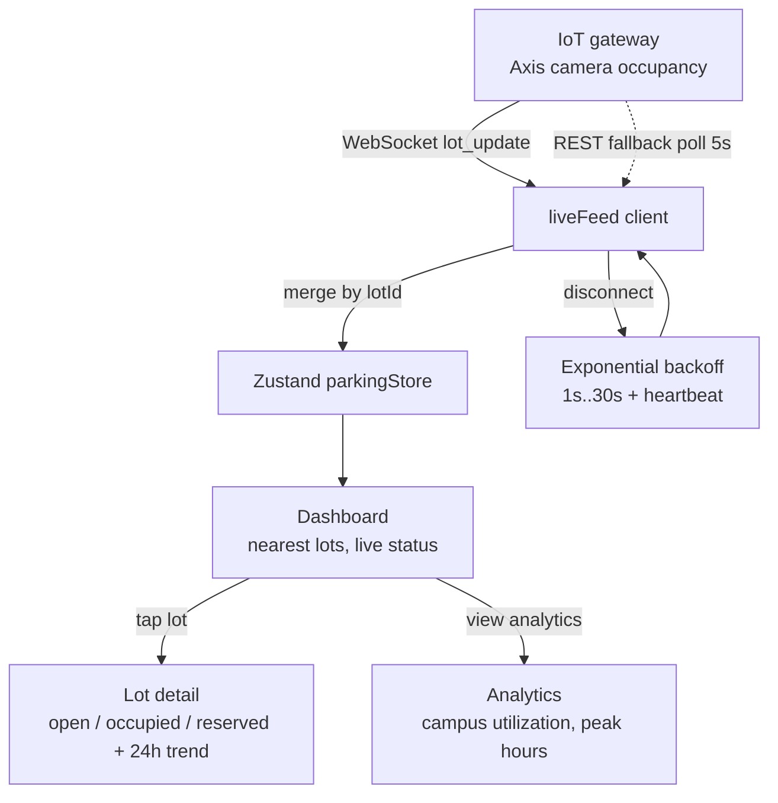

# expo-iot-parking-dashboard

A React Native + Expo POC for a real-time smart parking mobile app. Demonstrates the full shape of a campus / smart-city parking product: live lot occupancy data streamed from an IoT backend (Axis P3748-PLVE AI camera style), a minimal driver-facing UI, and an admin-style analytics drill-down.

## Demo



Live occupancy feed updating in real time, lot detail with a 24h trend, and a campus-wide analytics dashboard.

## Screenshots

| Live dashboard | Lot detail | Analytics |
| --- | --- | --- |
|  |  |  |

## App flow



## Tech stack

- Expo (Managed, EAS Build)
- TypeScript (strict)
- Zustand for real-time state
- expo-router for navigation
- react-native-maps for lot visualization
- expo-location for nearby lot sorting
- WebSocket + REST client with reconnect, backoff, and heartbeat

## What this POC covers

- Real-time lot occupancy: open, occupied, and reserved space counts per lot
- Live updates via WebSocket with exponential backoff reconnect
- Graceful fallback to REST polling when websockets are unavailable
- Minimal driver UI: sort nearby lots by distance, tap to see lot detail
- Lot detail screen: real-time count, trend sparkline, directions CTA
- Analytics drill-down: peak hours, historical usage, lot-level reporting
- Backend client designed to plug into Google Cloud (Pub/Sub + Cloud Run)

## Project structure

```
app/
  _layout.tsx, index.tsx (dashboard list), lot/[id].tsx (detail), analytics.tsx
src/
  store/       parkingStore (lots, live status, connection)
  services/    iotApi (REST client for Axis-style backend)
               liveFeed (WebSocket client with reconnect)
               mockBackend (in-memory backend for the POC)
               distance (haversine helper)
  components/  LotCard, StatusPill, TrendChart
```

## How the live feed works

1. `liveFeed.connect()` opens a WebSocket to the IoT gateway
2. Server pushes `{ type: 'lot_update', lotId, open, occupied, reserved, ts }`
3. The Zustand store merges updates by `lotId` so React re-renders only affected lots
4. On disconnect, `liveFeed` retries with exponential backoff (1s, 2s, 4s, 8s, capped at 30s)
5. Heartbeats every 15 seconds; three missed heartbeats force reconnect
6. If the WS endpoint is cold or blocked, `iotApi.pollLots()` runs every 5 seconds as fallback

## Keywords

React Native, Expo, TypeScript, IoT, Smart Parking, Smart City, Parking, Real-time, WebSocket, REST API, Google Cloud, Pub/Sub, Cloud Run, Axis Camera, Occupancy, Live Feed, Maps, react-native-maps, Geolocation, expo-location, Zustand, Analytics Dashboard, Campus, University, Backoff, Reconnect, Heartbeat, Clean Architecture

## Status

Portfolio POC. The WebSocket and REST layers are designed to drop in behind a real IoT gateway; the in-memory mockBackend drives the UI locally.
